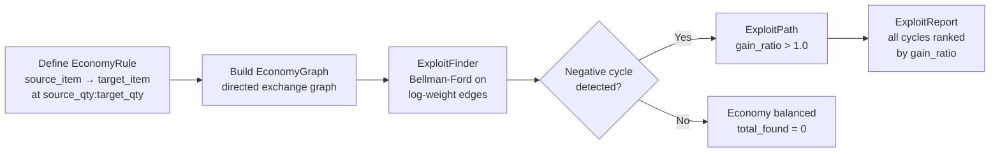

# balancelab

**Detect runaway exchange loops in any token economy — game balance, AI spend, or reward-function auditing.**


[](https://github.com/sandeep-alluru/balancelab/actions/workflows/ci.yml)
[](https://pypi.org/project/balancelab/)
[](https://pypi.org/project/balancelab/)
[](https://pypi.org/project/balancelab/)
[](LICENSE)
[](https://codecov.io/gh/sandeep-alluru/balancelab)
[](https://mypy-lang.org/)

[Quick Start](#quick-start) · [How It Works](#how-it-works) · [CLI Reference](#cli-reference) · [MCP / Claude](#mcp--claude) · [vs. Alternatives](#vs-alternatives) · [Contributing](CONTRIBUTING.md)

---

## Why

Any system with exchange rules — tokens, compute budgets, reward points, or in-game currency — can develop runaway loops that the designers never intended. The loops are mathematically inevitable once the exchange graph contains a negative cycle; the only question is whether you find them first.

**Game economies:** A crafting loop that converts gold → silver → gems → gold at a net gain of 24x will be found by players within hours of launch — not by QA. Manual balance spreadsheets don't scale. Playtesting can't enumerate all cycles.

**AI token budgets:** An analytics pipeline discovers that re-expanding summaries and re-scoring them earns more "quality credit" than it costs in tokens — so it loops. By month-end the pipeline consumed 26x its monthly budget. 78% of teams have no per-workflow token alert; they see the overrun on the billing page, not in a dashboard.

**Reward-function auditing:** An RL agent finds a sequence of actions where each step earns more reward than it costs — a classic reward-hacking loop. balancelab encodes the reward structure as an exchange graph and detects the profitable cycle before the agent finds it.

balancelab treats any set of exchange rules as a directed graph, applies Bellman-Ford on log-weighted edges, and produces an exploit report with exact gain ratios — before launch or before your next billing cycle.

```
balancelab scan --format json   # CI-friendly, fails on exploits
```

---

## Use Cases

### AI token spend monitoring

Model a multi-workflow AI pipeline as an economy where each model call costs tokens and each quality-score credit refills the budget. balancelab finds the loop before it inflates your bill 26×.

```python
from balancelab import EconomyGraph, EconomyRule, ExploitFinder, recommend_fixes

graph = EconomyGraph()
# Analytics pipeline: each quality_score credit = 3500 new budget tokens
graph.add_rule(EconomyRule("budget_tokens", "quality_score", 200.0, 1.0, rule_id="score"))
graph.add_rule(EconomyRule("quality_score", "budget_tokens", 1.0, 3500.0, rule_id="redeem"))

report = ExploitFinder().find_exploits(graph)
# → ExploitReport(exploits=[ExploitPath(path=[budget_tokens → quality_score → budget_tokens], gain_ratio=17.5)])

for fix in recommend_fixes(report):
    print(fix.fix_type, fix.description)   # rate_cap: cap the redeem edge
```

See [`examples/ai_token_budget_monitor.py`](examples/ai_token_budget_monitor.py) for a full walkthrough including budget projection and sensitivity analysis.

### Game economy balance

A crafting loop `gold → silver → gems → gold` at 24x gain will be found by players within hours of launch. balancelab encodes your exchange rules and proves whether arbitrage is possible — before it ships.

See [`examples/demo.py`](examples/demo.py) for the classic game economy example.

---

## How It Works



**Core primitives:**

- **EconomyRule** — an immutable, content-addressed exchange: give `source_qty` of `source_item`, receive `target_qty` of `target_item`. ID = SHA-256[:16] of the rule parameters. Same rule always produces the same ID.
- **EconomyGraph** — a directed graph of EconomyRules. Supports neighbor traversal and serialization.
- **ExploitFinder** — converts exchange rates to log-weights (`weight = -log(rate)`). A negative cycle in the log-weight graph corresponds to a positive-gain cycle in the economy. Uses Bellman-Ford for O(V·E) detection.
- **ExploitPath** — a single circular trade path with its gain ratio (e.g., 24.0x).
- **ExploitReport** — the full scan result: item count, rule count, all exploit paths, timestamp.

Facts are stored in a local SQLite database. No server required.

---

## Features

| Feature | Details |
|---------|---------|
| Graph-based exploit detection | Bellman-Ford on log-weight graph finds all profitable cycles |
| Content-addressed rules | Same exchange always produces the same ID — no duplicates |
| Gain ratio ranking | Every exploit path shows exact multiplier (e.g., 24.0x) |
| Offline / local-first | Single SQLite file, no server required |
| CI exit code | `balancelab scan` returns non-zero if exploits found |
| JSON output | Machine-readable output for downstream automation |
| Markdown output | Ready-to-paste GitHub PR comment |
| FastAPI REST server | `/rule`, `/rules`, `/scan`, `/reports`, `/health` endpoints |
| MCP server | Model Context Protocol integration for Claude and other agents |
| OpenAI tool spec | `tools/openai-tools.json` for GPT function calling |
| 45 tests | Comprehensive test suite covering all layers |

---

## Quick Start

```bash
pip install balancelab
```

```python
from balancelab.economy import EconomyRule, EconomyGraph, ExploitFinder
from balancelab.report import print_report

# Define your economy's exchange rules
graph = EconomyGraph()
graph.add_rule(EconomyRule("gold", "silver", 1.0, 3.0, rule_id="mint"))
graph.add_rule(EconomyRule("silver", "gems", 1.0, 2.0, rule_id="jeweler"))
graph.add_rule(EconomyRule("gems", "gold", 1.0, 4.0, rule_id="trader"))

# Find exploits
finder = ExploitFinder()
report = finder.find_exploits(graph)

# Display results
print_report(report)
# Exploit Report (id: a3f8b2c1d4e5f6a7)
#   Items: 3  Rules: 3
#   Exploits found: 1
# ┌──────────────────┬─────────────────────────────────────────┬────────────┐
# │ ID               │ Path                                    │ Gain Ratio │
# ├──────────────────┼─────────────────────────────────────────┼────────────┤
# │ 4d7e9c2a1b8f3e6a │ gold → silver → gems → gold             │ 24.00x     │
# └──────────────────┴─────────────────────────────────────────┴────────────┘
```

---

## CLI Reference

```bash
balancelab [--db PATH] COMMAND [OPTIONS]
```

| Command | Description | Key options |
|---------|-------------|-------------|
| `add SOURCE TARGET SRC_QTY TGT_QTY` | Add an exchange rule | `--rule-id LABEL`, `--db PATH` |
| `scan` | Find exploits in stored rules | `--format {rich,json}`, `--db PATH` |
| `report REPORT_ID` | Show a specific exploit report | `--format {rich,json}`, `--db PATH` |
| `log` | List all exploit reports | `--db PATH` |
| `status` | Show rule count and last scan | `--db PATH` |
| `simulate GRAPH_FILE` | Simulate economy from a JSON graph file | `--steps N`, `--strategy {greedy,balanced,exploit}`, `--format {rich,json}` |
| `fixes` | Show fix recommendations for the latest exploit report | `--report-id ID`, `--db PATH` |

**Global options:**

| Option | Default |
|--------|---------|
| `--db PATH` | `.balancelab/economy.db` |

**Examples:**

```bash
# Add exchange rules
balancelab add gold silver 1.0 3.0 --rule-id mint
balancelab add silver gems 1.0 2.0 --rule-id jeweler
balancelab add gems gold 1.0 4.0 --rule-id trader

# Scan for exploits
balancelab scan

# Machine-readable output (for CI)
balancelab scan --format json

# Review previous scans
balancelab log
```

---

## MCP / Claude

balancelab ships a [Model Context Protocol](https://modelcontextprotocol.io/) server. Add it to Claude Desktop:

```json
{
  "mcpServers": {
    "balancelab": {
      "command": "balancelab-mcp"
    }
  }
}
```

Available MCP tools: `add_rule`, `scan_economy`, `list_reports`.

Install with MCP support: `pip install "balancelab[mcp]"`

You can also find balancelab on [Smithery](https://smithery.ai/) for one-click MCP installation.

---

## REST Server

balancelab ships a FastAPI server exposing all core operations over HTTP.

```bash
pip install "balancelab[api]"
uvicorn balancelab.api:app --reload
```

Available endpoints:

| Method | Path | Description |
|--------|------|-------------|
| `POST` | `/rule` | Add an exchange rule |
| `GET` | `/rules` | List all rules |
| `POST` | `/scan` | Run exploit scan |
| `GET` | `/reports` | List all reports |
| `GET` | `/health` | Health check |

The full OpenAPI spec is in [`openapi.yaml`](openapi.yaml).

---

## OpenAI

Use `tools/openai-tools.json` for OpenAI function calling:

```python
import json, openai
tools = json.load(open("tools/openai-tools.json"))
response = openai.chat.completions.create(
    model="gpt-4o",
    tools=tools,
    messages=[{"role": "user", "content": "Scan my economy for exploits"}],
)
```

---

## Advanced API

Beyond the core exploit detection primitives, balancelab exposes several higher-level APIs imported directly from the package:

```python
from balancelab import (
    simulate,
    recommend_fixes,
    sensitivity_analysis,
    critical_path,
    BalanceFix,
    SensitivityResult,
    SimulationResult,
)
```

### `simulate(graph, initial_levels, n_steps=100, agent_strategy="greedy") -> SimulationResult`

Run a forward simulation of the economy. Strategies: `"greedy"` (apply every rule each step), `"balanced"` (one rule per source item), `"exploit"` (agent actively exploits known cycles).

```python
from balancelab import simulate
from balancelab.economy import EconomyGraph, EconomyRule

graph = EconomyGraph()
graph.add_rule(EconomyRule("gold", "silver", 1.0, 3.0))
result = simulate(graph, {"gold": 100.0, "silver": 0.0}, n_steps=50, agent_strategy="exploit")
print(result.inflation_detected)   # True/False
print(result.final_levels)         # {"gold": ..., "silver": ...}
```

**`SimulationResult`** fields: `steps`, `final_levels`, `violated_rules`, `inflation_detected`, `inflation_resource`, `summary`.

### `recommend_fixes(report) -> list[BalanceFix]`

For each exploit in an `ExploitReport`, suggest the minimum intervention to neutralize it.

```python
from balancelab import recommend_fixes
fixes = recommend_fixes(report)
for fix in fixes:
    print(fix.fix_type, fix.target_edge, fix.suggested_value, fix.description)
```

**`BalanceFix`** fields: `exploit_path`, `fix_type` (`"rate_cap"`, `"cooldown"`, `"daily_limit"`, `"require_prerequisite"`), `target_edge`, `suggested_value`, `description`, `estimated_reduction_pct`.

### `sensitivity_analysis(graph, report) -> list[SensitivityResult]`

Rank all economy nodes by how much they affect overall balance, descending by `impact_score`.

```python
from balancelab import sensitivity_analysis
results = sensitivity_analysis(graph, report)
for r in results:
    print(r.node_id, r.impact_score, r.recommendation)
```

**`SensitivityResult`** fields: `node_id`, `node_type` (`"hub"`, `"source_only"`, `"target_only"`), `impact_score` (0–1), `connected_rules`, `exploit_involvement`, `recommendation` (`"monitor"`, `"rate-limit"`, `"gate"`).

### `critical_path(graph) -> list[str]`

Find the sequence of nodes with the highest economic throughput (most exchange-rate flow). Useful for identifying which items act as economic bottlenecks.

```python
from balancelab import critical_path
path = critical_path(graph)
print(" -> ".join(path))   # e.g. "gems -> gold -> silver"
```

---

## vs. Alternatives

| Approach | Scalability | Automation | Accuracy | Cost |
|----------|-------------|------------|----------|------|
| **balancelab** | Graph (O·V·E) | Full CI | Mathematical | Free |
| Manual spreadsheet | Poor | None | Error-prone | Low |
| Playtesting | Poor | None | Incomplete | High |
| Custom scripts | Variable | Manual | Variable | Medium |
| LLM-only analysis | N/A | Partial | Hallucination risk | High |
| Cloud billing alerts | Post-facto | Reactive only | Accurate but late | $$ |
| Per-model rate limits | Coarse-grained | Partial | Misses cross-model loops | Low |

---

## Repository Tree

```
balancelab/
├── src/balancelab/
│   ├── __init__.py          # Public API
│   ├── economy.py           # EconomyRule, EconomyGraph, ExploitFinder
│   ├── store.py             # SQLite persistence
│   ├── report.py            # Rich/JSON/Markdown formatters
│   ├── cli.py               # Click CLI
│   ├── api.py               # FastAPI server
│   └── mcp_server.py        # MCP server
├── tests/
│   ├── test_economy.py      # Data model tests
│   ├── test_exploit.py      # Bellman-Ford exploit detection
│   ├── test_store.py        # SQLite CRUD
│   ├── test_report.py       # Formatters
│   ├── test_cli_runner.py   # CLI integration
│   └── test_api.py          # FastAPI endpoints
├── tools/openai-tools.json  # OpenAI function calling spec
├── openapi.yaml             # Full OpenAPI 3.1 spec
├── examples/demo.py         # Standalone demo
└── smoke_test.py            # End-to-end smoke test
```

---

## GitHub Topics

Suggested topics for discoverability: `#game-economy` `#arbitrage` `#balance-testing` `#agents` `#mcp` `#llmops` `#python` `#cli` `#exploit-detection` `#graph-algorithms`

---

## Case Studies

See how teams are using balancelab in production:

- [Eliminating Economy Exploits Before Launch](docs/case-studies/gaming-economy-pre-launch.md) — Stellar Forge finds 5 exploits (including a 1,250x gain ratio) before shipping to 2M DAU
- [Catching Reward Hacking in an AI Agent Token Economy](docs/case-studies/ai-agent-reward-hacking.md) — Orbital Systems catches synthetic-task reward hacking in simulation before it reaches production

---

## Stay Updated

Subscribe to [**The Silence Layer**](https://newsletter.salluru.dev) — weekly dispatches on production AI infrastructure, new releases, and the failure modes that production AI systems don't surface until it's too late.

## Star History

[](https://star-history.com/#sandeep-alluru/balancelab&Date)

<!-- mcp-name: io.github.sandeep-alluru/balancelab -->
