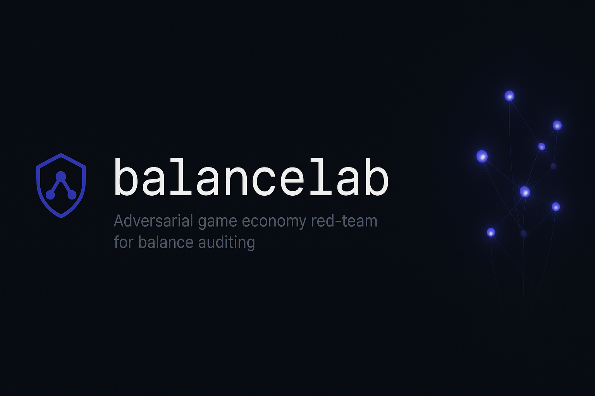
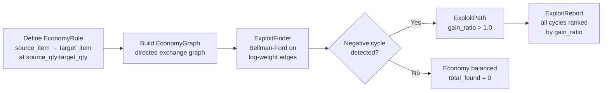

# balancelab

**Adversarial game economy red-team — detect arbitrage exploits before your players do.**



[](https://github.com/sandeep-alluru/balancelab/actions/workflows/ci.yml)
[](https://pypi.org/project/balancelab/)
[](https://pypi.org/project/balancelab/)
[](https://pypi.org/project/balancelab/)
[](LICENSE)
[](https://codecov.io/gh/sandeep-alluru/balancelab)
[](https://mypy-lang.org/)

[Quick Start](#quick-start) · [How It Works](#how-it-works) · [CLI Reference](#cli-reference) · [MCP / Claude](#mcp--claude) · [vs. Alternatives](#vs-alternatives) · [Contributing](CONTRIBUTING.md)

---

## Why

Game economies break in predictable ways. A crafting loop that converts gold → silver → gems → gold at a net gain of 24x will be found by players within hours of launch — not by QA. Manual balance spreadsheets don't scale. Playtesting can't enumerate all cycles. You need an automated red-team that treats your economy as a directed graph and mathematically proves whether arbitrage is possible.

balancelab does exactly that: encode your exchange rules, run `balancelab scan`, and get an exploit report showing every profitable cycle with exact gain ratios — before launch.

```
balancelab scan --format json   # CI-friendly, fails on exploits
```

---

## How It Works



**Core primitives:**

- **EconomyRule** — an immutable, content-addressed exchange: give `source_qty` of `source_item`, receive `target_qty` of `target_item`. ID = SHA-256[:16] of the rule parameters. Same rule always produces the same ID.
- **EconomyGraph** — a directed graph of EconomyRules. Supports neighbor traversal and serialization.
- **ExploitFinder** — converts exchange rates to log-weights (`weight = -log(rate)`). A negative cycle in the log-weight graph corresponds to a positive-gain cycle in the economy. Uses Bellman-Ford for O(V·E) detection.
- **ExploitPath** — a single circular trade path with its gain ratio (e.g., 24.0x).
- **ExploitReport** — the full scan result: item count, rule count, all exploit paths, timestamp.

Facts are stored in a local SQLite database. No server required.

---

## Features

| Feature | Details |
|---------|---------|
| Graph-based exploit detection | Bellman-Ford on log-weight graph finds all profitable cycles |
| Content-addressed rules | Same exchange always produces the same ID — no duplicates |
| Gain ratio ranking | Every exploit path shows exact multiplier (e.g., 24.0x) |
| Offline / local-first | Single SQLite file, no server required |
| CI exit code | `balancelab scan` returns non-zero if exploits found |
| JSON output | Machine-readable output for downstream automation |
| Markdown output | Ready-to-paste GitHub PR comment |
| FastAPI REST server | `/rule`, `/rules`, `/scan`, `/reports`, `/health` endpoints |
| MCP server | Model Context Protocol integration for Claude and other agents |
| OpenAI tool spec | `tools/openai-tools.json` for GPT function calling |
| 45 tests | Comprehensive test suite covering all layers |

---

## Quick Start

```bash
pip install balancelab
```

```python
from balancelab.economy import EconomyRule, EconomyGraph, ExploitFinder
from balancelab.report import print_report

# Define your economy's exchange rules
graph = EconomyGraph()
graph.add_rule(EconomyRule("gold", "silver", 1.0, 3.0, rule_id="mint"))
graph.add_rule(EconomyRule("silver", "gems", 1.0, 2.0, rule_id="jeweler"))
graph.add_rule(EconomyRule("gems", "gold", 1.0, 4.0, rule_id="trader"))

# Find exploits
finder = ExploitFinder()
report = finder.find_exploits(graph)

# Display results
print_report(report)
# Exploit Report (id: a3f8b2c1d4e5f6a7)
#   Items: 3  Rules: 3
#   Exploits found: 1
# ┌──────────────────┬─────────────────────────────────┬────────────┐
# │ ID               │ Path                            │ Gain Ratio │
# ├──────────────────┼─────────────────────────────────┼────────────┤
# │ 4d7e9c2a1b8f3e6a │ gold → silver → gems → gold     │ 24.00x     │
# └──────────────────┴─────────────────────────────────┴────────────┘
```

---

## CLI Reference

```bash
balancelab [--db PATH] COMMAND [OPTIONS]
```

| Command | Description | Key options |
|---------|-------------|-------------|
| `add SOURCE TARGET SRC_QTY TGT_QTY` | Add an exchange rule | `--rule-id LABEL`, `--db PATH` |
| `scan` | Find exploits in stored rules | `--format {rich,json}`, `--db PATH` |
| `report REPORT_ID` | Show a specific exploit report | `--format {rich,json}`, `--db PATH` |
| `log` | List all exploit reports | `--db PATH` |
| `status` | Show rule count and last scan | `--db PATH` |

**Global options:**

| Option | Default |
|--------|---------|
| `--db PATH` | `.balancelab/economy.db` |

**Examples:**

```bash
# Add exchange rules
balancelab add gold silver 1.0 3.0 --rule-id mint
balancelab add silver gems 1.0 2.0 --rule-id jeweler
balancelab add gems gold 1.0 4.0 --rule-id trader

# Scan for exploits
balancelab scan

# Machine-readable output (for CI)
balancelab scan --format json

# Review previous scans
balancelab log
```

---

## MCP / Claude

balancelab ships a [Model Context Protocol](https://modelcontextprotocol.io/) server. Add it to Claude Desktop:

```json
{
  "mcpServers": {
    "balancelab": {
      "command": "balancelab-mcp"
    }
  }
}
```

Available MCP tools: `add_rule`, `scan_economy`, `list_reports`.

Install with MCP support: `pip install "balancelab[mcp]"`

You can also find balancelab on [Smithery](https://smithery.ai/) for one-click MCP installation.

---

## OpenAI

Use `tools/openai-tools.json` for OpenAI function calling:

```python
import json, openai
tools = json.load(open("tools/openai-tools.json"))
response = openai.chat.completions.create(
    model="gpt-4o",
    tools=tools,
    messages=[{"role": "user", "content": "Scan my economy for exploits"}],
)
```

---

## vs. Alternatives

| Approach | Scalability | Automation | Accuracy | Cost |
|----------|-------------|------------|----------|------|
| **balancelab** | Graph (O·V·E) | Full CI | Mathematical | Free |
| Manual spreadsheet | Poor | None | Error-prone | Low |
| Playtesting | Poor | None | Incomplete | High |
| Custom scripts | Variable | Manual | Variable | Medium |
| LLM-only analysis | N/A | Partial | Hallucination risk | High |

---

## Repository Tree

```
balancelab/
├── src/balancelab/
│   ├── __init__.py          # Public API
│   ├── economy.py           # EconomyRule, EconomyGraph, ExploitFinder
│   ├── store.py             # SQLite persistence
│   ├── report.py            # Rich/JSON/Markdown formatters
│   ├── cli.py               # Click CLI
│   ├── api.py               # FastAPI server
│   └── mcp_server.py        # MCP server
├── tests/
│   ├── test_economy.py      # Data model tests
│   ├── test_exploit.py      # Bellman-Ford exploit detection
│   ├── test_store.py        # SQLite CRUD
│   ├── test_report.py       # Formatters
│   ├── test_cli_runner.py   # CLI integration
│   └── test_api.py          # FastAPI endpoints
├── tools/openai-tools.json  # OpenAI function calling spec
├── openapi.yaml             # Full OpenAPI 3.1 spec
├── examples/demo.py         # Standalone demo
└── smoke_test.py            # End-to-end smoke test
```

---

## GitHub Topics

Suggested topics for discoverability: `#game-economy` `#arbitrage` `#balance-testing` `#agents` `#mcp` `#llmops` `#python` `#cli` `#exploit-detection` `#graph-algorithms`

---

## Case Studies

See how teams are using balancelab in production:

- [Eliminating Economy Exploits Before Launch](docs/case-studies/gaming-economy-pre-launch.md) — Stellar Forge finds 5 exploits (including a 1,250x gain ratio) before shipping to 2M DAU
- [Catching Reward Hacking in an AI Agent Token Economy](docs/case-studies/ai-agent-reward-hacking.md) — Orbital Systems catches synthetic-task reward hacking in simulation before it reaches production

## Star History

[](https://star-history.com/#sandeep-alluru/balancelab&Date)
