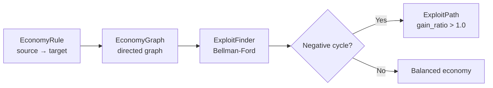

# balancelab

**Adversarial game economy red-team — detect arbitrage exploits before your players do.**

## Install

```bash
pip install balancelab
```

## Quick example

```bash
balancelab add gold silver 1.0 3.0 --rule-id mint
balancelab add silver gems 1.0 2.0 --rule-id jeweler
balancelab add gems gold 1.0 4.0 --rule-id trader
balancelab scan
```

## Why

Game economies break in predictable ways. A crafting loop that converts gold → silver → gems → gold
at a net gain of 24x will be found by players within hours of launch. Manual balance spreadsheets
don't scale. Playtesting can't enumerate all cycles. balancelab mathematically proves whether
arbitrage is possible using Bellman-Ford graph analysis.

## How it works



## Navigation

- [Quick Start](quickstart.md)
- [CLI Reference](cli-reference.md)
- [Python API](api-reference.md)
- [Architecture](architecture.md)
- [MCP / Claude](mcp.md)
- [OpenAI Integration](openai.md)
- [Changelog](changelog.md)
